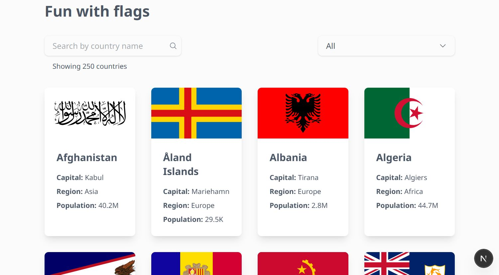

# Fun with Flags

**Fun with Flags** é um projeto desenvolvido para explorar e aprender sobre os países do mundo. Ele oferece uma interface interativa onde os usuários podem visualizar, pesquisar e obter informações sobre diferentes bandeiras.

## Tecnologias Utilizadas

- **Next.js**: Framework React para desenvolvimento de aplicações web modernas.
- **TypeScript**: Superset do JavaScript que adiciona tipagem estática ao código.
- **Styled Components**: Biblioteca para estilização de componentes utilizando CSS-in-JS e TailwindCSS.

## Funcionalidades

- ✅ **Visualização de Bandeiras**: Exibe uma lista de bandeiras de diversos países.
- ✅ **Detalhes do País**: Ao selecionar uma bandeira, o usuário pode visualizar informações detalhadas sobre o país correspondente.
- ✅ **Pesquisa**: Funcionalidade para buscar países específicos pelo nome e/ou região.

## Como Executar o Projeto

1. **Clone o repositório**:

   ```
   git clone https://github.com/ViniciusEduardoDias/fun-with-flags.git```
   

2. **Navegue até o diretório do projeto**:

´´´
cd fun-with-flags
´´´

3. **Instale as dependências**:

´´´
npm install
´´´
ou

´´´
yarn install
´´´ 
4. **Inicie o servidor de desenvolvimento**:

´´´
npm run dev
´´´
ou

´´´
yarn dev
´´´

5. **Acesse a aplicação**:

1. Abra o navegador e vá para:

```
http://localhost:3000
´´´

6. Estrutura do Projeto

´´´plaintext

/fun-with-flags
│── /components   # Componentes reutilizáveis
│── /pages        # Páginas do projeto (Next.js)
│── /styles       # Estilos globais e temas
│── /utils        # Funções utilitárias
│── package.json  # Dependências e scripts do projeto
│── tsconfig.json # Configuração do TypeScript
│── README.md     # Documentação do projeto
´´´